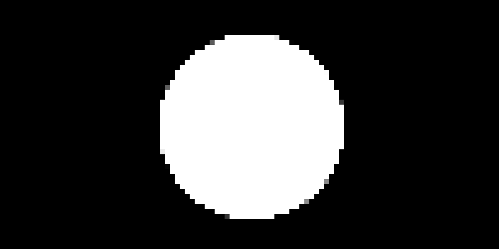
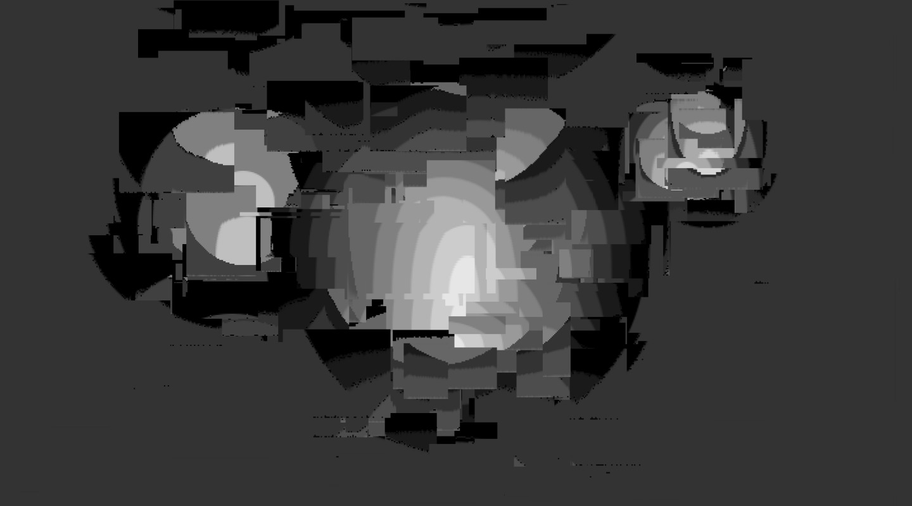
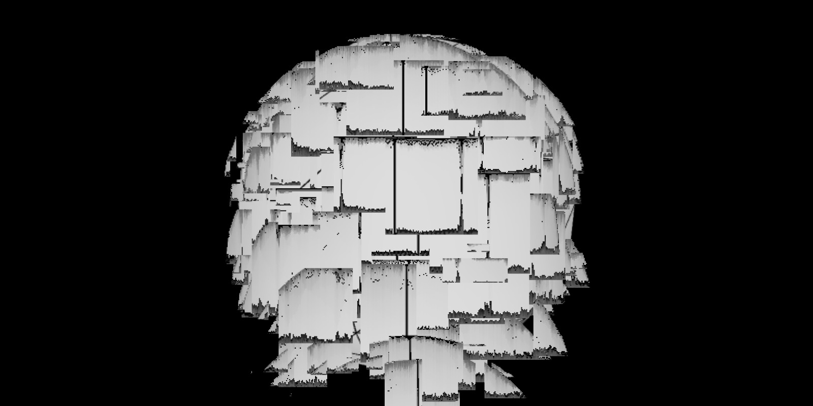
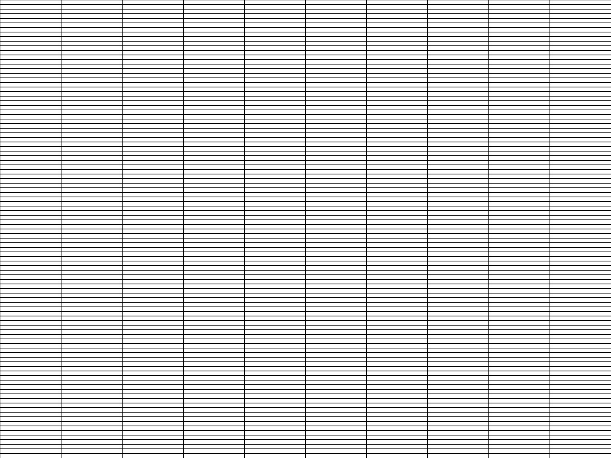

# p5-toolkit


A small set of effects and useful functions for [p5.js](https://p5js.org/ "p5.js"),
a JavaScript library for creative coding.

## A personal toolkit for creating static images with p5
This is a personal toolkit that I share with you. Feel free to use it in any way,
shape or form you can imagine. The toolkit (currrently in development) is a single
JavaScript class you could add to any of your sketches and use it to post process
the results. See the examples below how you might include it.

```html
  <!-- Included in your index.html before the sketch -->
  <script src="p5-global-effects.min.js" defer></script>
  <script src="sketch.js" defer></script>
```

### Using graphics buffers
The class is written around the idea of using graphics buffers within your p5 sketch.
A graphics buffer can be created with ``createGraphics(w, h, [renderer])``.
When called, this function returns a ``p5.Graphics: offsscreen graphics buffer``, which is nothing
other then a p5 sketch. You can use it's name with the dot syntax and draw anything into the buffer.
It works just like in a regular sketch. With the ``image(img, x, y)`` function we can render any
offscreen buffer back onto the stage.

#### Work with your custom buffers

```javascript
function setup() {
  // Import the effects class
  const effects = new Effects(this);

  // Create the canvas 2d context
  createCanvas(800, 400);

  // Create a 2d buffer with a design
  const design = createGraphics(width, height);
  design.circle(400, 200, 300);

  // Render the design with an effect
  image(effects.mosaic(design), 0, 0);

  // Render file
  save('buffer-demo.jpg')
}
```

#### Import the effects in any sketch

```javascript
// https://p5js.org/examples/structure-functions.html

// Added as a variable
let effects;

function setup() {
  createCanvas(720, 400);
  background(51);
  noStroke();
  noLoop();
}

function draw() {
  drawTarget(width * 0.25, height * 0.4, 200, 4);
  drawTarget(width * 0.5, height * 0.5, 300, 10);
  drawTarget(width * 0.75, height * 0.3, 120, 6);

  // Added the effects
  effects = new Effects(this);
  let design = get();
  clear();
  design = effects.glitchY(design);
  image(design, 0, 0);
  save('any-demo.jpg');
}

function drawTarget(xloc, yloc, size, num) {
  const grayvalues = 255 / num;
  const steps = size / num;
  for (let i = 0; i < num; i++) {
    fill(i * grayvalues);
    ellipse(xloc, yloc, size - i * steps, size - i * steps);
  }
}
```

#### Even WEBGL sketches work fine


```javascript
function setup() {
  const effects = new Effects(this);
  createCanvas(800, 400, WEBGL);
  lights();
  sphere(150);
  const design = get();
  clear();
  image(effects.glitchY(design), -400, -200);
  save('webgl-demo.jpg');
}
```


# All available Methods

## Color tools
- [x] ```randomColor()``` Any possible color
- [x] ```randomBrightColor()``` A brighter color
- [x] ```randomDarkColor()``` A darker color
- [x] ```shadedColor(col)``` A randomly changed color with low offset
- [x] ```shadedColorOff(col, off)``` A randomly changed color and public offset
- [x] ```randomPalette(col, len)``` A color palette with a number of colors and a initial color
- [x] ```relatedPalette(col, len)``` A color palette with colors based on the initial color
- [ ] ```huePalette(col, len)``` A color palette with evenly spread hue based the initial color

```javascript
function setup() {
  // Import the effects class
  const effects = new Effects(this);
  // Use it to create a color scheme
  const themeBright = effects.randomBrightColor();
  const themeBrightVariant = effects.shadedColor(themeBright);
  const themeDark = effects.randomDarkColor();
  const themeAccent = effects.randomColor()
  // ...
  // Or use the ready mades
  // This will make an array with the inital color and 4 random colors
  const pal1 = effects.randomPalette(color(200, 10, 20), 5);
  // This will make an array with the inital color and 4 similar random colors
  const pal2 = effects.relatedPalette(color(200, 10, 20), 5);
  // ...
}
```

## Pixel effects


### Available functions
- [x] ```randomBlurX(buffer) ``` A graphics buffer with dramatically changed colors
- [x] ```fuzzyBlurX(buffer)``` A graphics buffer with dramatically changed colors
- [x] ```mosaic(buffer)``` A graphics buffer with a tiled tesselation
- [x] ```shiftedPixels(buffer)``` A graphics buffer with sifted rows of pixels
- [x] ```sortColors(buffer)``` A graphics buffer with color sorted pixels
- [x] ```glitch(buffer)``` A graphics buffer a dramatic pixel manipulation effect

**A custom buffer**
```javascript
function setup() {
  const effects = new Effects(this);
  createCanvas(800, 600);

  const design = createGraphics(width, height);
  design.circle(400, 300, 100);

  // Render the design with an effect
  image(effects.mosaic(design), 0, 0);
}
```

## Hatches


### Example
```javascript
function setup() {
  createCanvas(800, 600);
  background(255);

  const effects = new Effects(this);
  image(effects.hatchHorizontal(width, height, 0.01), 0, 0);
  image(effects.hatchVertical(width, height, 0.1), 0, 0);
  save('hatches-demo.jpg');
}
```
### Available functions
- [x] ```stripes(res, colors)``` A randomly striped graphics buffer
- [x] ```dots(res, colors)```  A randomly dotted graphics buffer
- [x] ```hatchHorizontal(w, h, d)```
- [x] ```hatchVertical(w, h, d)```
- [ ] ```hatchGrid(w, h, d)```
- [ ] ```hatchDotGrid(w, h, d)```
- [ ] ```hatchRandomDots(w, h, d)```
- [ ] ```hatchRandomLines(w, h, d)```
- [ ] ```hatchMaze(w, h, d)```
- [ ] ```hatchSinusLines(w, h, d)```
- [ ] ```hatchFlowField(w, h, d)```


## Masking effects
- ```grainMask(buffer, prob)``` A buffer with a grainy alpha mask
- ```linesMask(buffer, prob)``` A buffer with a striped alpha mask

```javascript
// Currently
const final1 = effects.grainMask(design, d)
const final2 = effects.linesMask(design, d)
```

## Random number tools
- ```randomOffset(val, off)``` A value with random positive or negative offset
- ```randomZeroOne()``` A random number between 0 and 1
- ```randomProb()``` True with a 50% percent probability
- ```givenProb(prob)``` True/false by given probability
- ```fuzzyValue(val)``` Either a slightly changed or dramtically reduced value

## WEBGL light effects
- ```randomLight(buffer)```  Sets a white light in a random position in a buffer
- ```randomColoredLight(buffer, col)``` Sets a colored light in a random position in a buffer


# A few examples


## Example Basic
https://editor.p5js.org/matthias-jaeger-net/sketches/PQrZMbk45

## Example Intermediate
https://editor.p5js.org/matthias-jaeger-net/sketches/sN_Qu58Go

## Example Advanced
https://editor.p5js.org/matthias-jaeger-net/sketches/9FTcIkn-r

## Example Yetiadvanced
https://editor.p5js.org/matthias-jaeger-net/sketches/cFctVV7R2