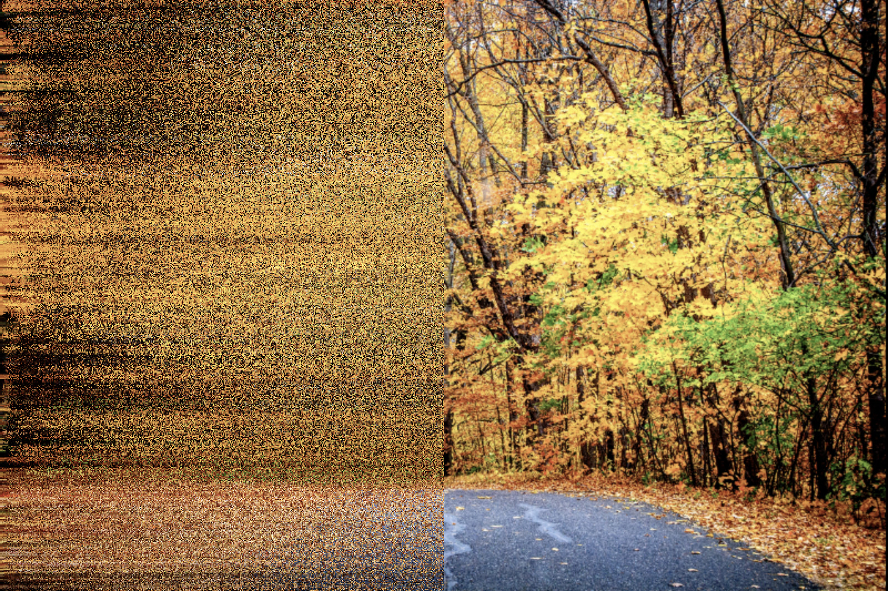
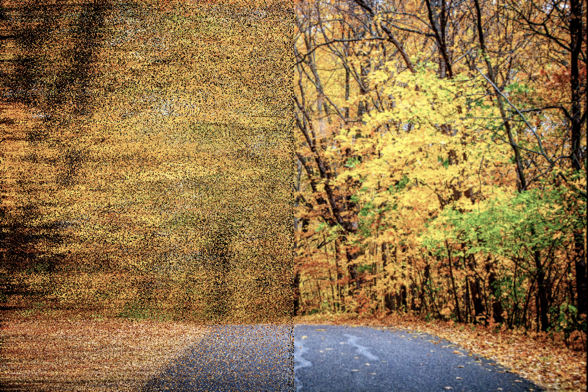
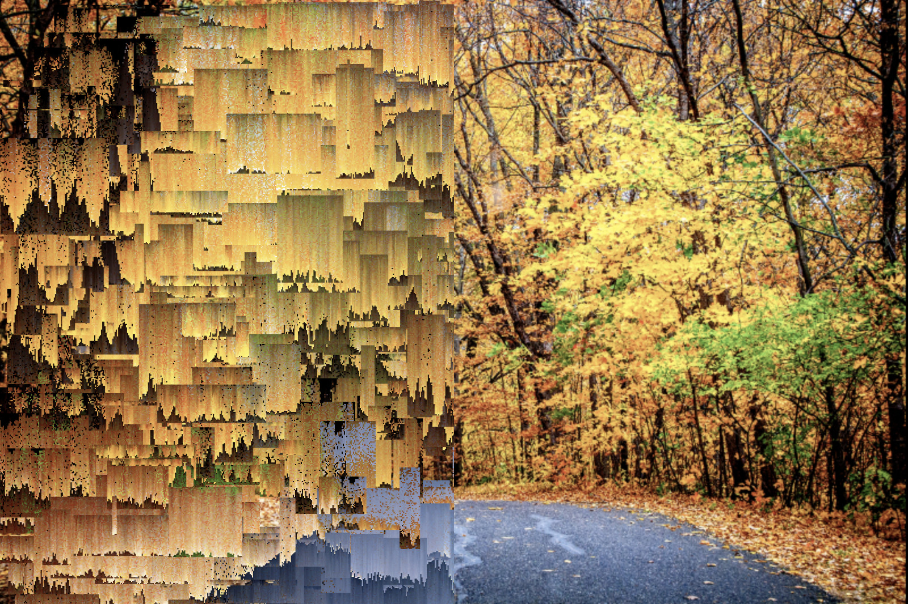

# p5-toolkit


# A collection of artistic post-processing-effects and other visual trickery in the context of [p5 sketches](https://p5js.org/).

A personal collection of functions I frequently use when I create [generative images](https://www.instagram.com/_matthiasjaeger/). It contains methods for colos, numbertweaks, image effect functions and other useful tools. See a short overview below or browse the [type docs](/docs) for a detailed information. The script adds a globally available class constructor called ``Effects`` to your disposal. The intended use is to locally create a new instance in ```setup()```and use it's methods via the dot-syntax. Include the script in ```index.html``` and use it in ```sketch.js```.

```html
  <script src="p5-global-effects.min.js" defer></script>
  <script src="sketch.js" defer></script>
```
```javascript
function setup() {
  const effects = new Effects(this);
  background(effects.randomColor());
}
```
# The pixel effects
All pixels effects take a graphics buffer or a preloaded image as an input and return a new buffer with a dramatically changed appearance. In the examples below the effect is applied on the left half of this [landscape](https://unsplash.com/photos/dM8INmkyDas).

## ```randomBlurX(buffer) ```

## ```fuzzyBlurX(buffer)```

## ```mosaic(buffer)```

## ```shiftedPixels(buffer)```

## ```glitchY(buffer)```


# All available Methods
## Random number tools
- [x] ```randomOffset(val, off)``` A value with random positive or negative offset
- [x] ```randomZeroOne()``` A random number between 0 and 1
- [x] ```randomProb()``` True with a 50% percent probability
- [x] ```givenProb(prob)``` True/false by given probability
- [x] ```fuzzyValue(val)``` Either a slightly changed or dramtically reduced value

## Color tools
- [x] ```randomColor()``` Any possible color
- [x] ```randomBrightColor()``` A brighter color
- [x] ```randomDarkColor()``` A darker color
- [x] ```shadedColor(col)``` A randomly changed color with low offset
- [x] ```shadedColorOff(col, off)``` A randomly changed color and public offset
- [x] ```randomPalette(col, len)``` A color palette with a number of colors and a initial color
- [x] ```relatedPalette(col, len)``` A color palette with colors based on the initial color
- [ ] ```huePalette(col, len)``` A color palette with evenly spread hue based the initial color

## Pixel effects
- [x] ```randomBlurX(buffer) ``` A graphics buffer with dramatically changed colors
- [x] ```fuzzyBlurX(buffer)``` A graphics buffer with dramatically changed colors
- [x] ```mosaic(buffer)``` A graphics buffer with a tiled tesselation
- [x] ```shiftedPixels(buffer)``` A graphics buffer with sifted rows of pixels
- [x] ```sortColors(buffer)``` A graphics buffer with color sorted pixels
- [x] ```glitchY(buffer)``` A graphics buffer a dramatic pixel manipulation effect

## Hatches
- [x] ```stripes(res, colors)``` A really randomly striped graphics buffer
- [x] ```dots(res, colors)```  A randomly dotted graphics buffer
- [x] ```hatchHorizontal(w, h, d, col)``` Regular hatching horizontally
- [x] ```hatchVertical(w, h, d, col)``` Regular hatching vertically
- [ ] ```hatchGrid(w, h, d)```
- [x] ```hatchDotGrid(w, h, d)```
- [ ] ```hatchRandomDots(w, h, d)```
- [ ] ```hatchRandomLines(w, h, d)```
- [ ] ```hatchMaze(w, h, d)```
- [ ] ```hatchSinusLines(w, h, d)```
- [ ] ```hatchFlowField(w, h, d)```

## Masking effects
- [x] ```grainMask(buffer, prob)``` A buffer with a grainy alpha mask
- [x] ```linesMask(buffer, prob)``` A buffer with a striped alpha mask

## WEBGL light effects
- [x] ```randomLight(buffer)```  Sets a white light in a random position in a buffer
- [x] ```randomColoredLight(buffer, col)``` Sets a colored light in a random position in a buffer

## Typographic effects
- [ ] ```TODO```

## Blending effects
- [ ] ```TODO```

## You want to develop Effects yourself?
```bash
# Clone the repository
git clone git@github.com:matthias-jaeger-net/p5-toolkit.git

# Navigate in the directory
cd p5-toolkit

# Install the development tools
npm install
```
This will install the node modules i use for the development. You can check the [package.json](/package.json) for a full list. Briefly said it will install a very simple Webpack/Typescript setup for you. Having said that, because sometimes it can be strange with node modules...

**Available scripts**
```bash
# This generates the minified file in /dist/
npm run build

# This outputs the raw commonjs modules, not used currently
npm run compile

# Have no unit tests so far...
npm run test

# This generates api docs from typescript /src
npm run docs
```