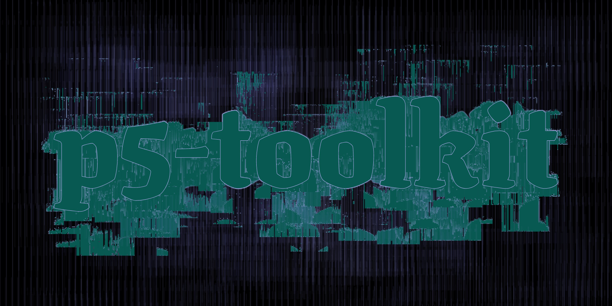

# A personal collection of effects in the context of [p5 sketches](https://p5js.org/).

I use this single JavaScript class to quickly create artistic [generative images](https://www.instagram.com/_matthiasjaeger/) with a great variety. The collection contains methods for **colors**, **numbers**, **pixels**, **textures** and **hatches**. See a short overview below or browse the [type docs](/docs) for a detailed information. These effects could be useful for **artists**, **designers** and fellow **creative coders**. Please be aware that this is a *personal* collection and it might change dramatically without warnings. The script adds a globally available class constructor called ``Effects`` to your disposal. The intended use is to locally create a *new instance* in ```setup()``` and use it's methods via the dot-syntax. Include the script in ```index.html``` and use it in ```sketch.js```.

```
index.ts
├── numbers
│   ├── Numbers.ts
│   └── modules
│       ├── fuzzy.ts
│       ├── offset.ts
│       └── random.ts
├── choices
│   ├── Choices.ts
│   └── modules
│       ├── often.ts
│       ├── probability.ts
│       ├── rarely.ts
│       └── sometimes.ts
├── colors
│   ├── Colors.ts
│   └── modules
│       ├── any.ts
│       ├── anySet.ts
│       ├── bright.ts
│       ├── dark.ts
│       ├── shade.ts
│       └── shadeSet.ts
├── pixels
│   ├── Pixels.ts
│   └── modules
│       ├── fuzzy.ts
│       ├── glitch.ts
│       ├── glitchArea.ts
│       ├── linify.ts
│       ├── mosaic.ts
│       ├── puzzle.ts
│       ├── shift.ts
│       ├── shrink.ts
│       ├── spread.ts
│       └── waves.ts
├── hatches
│   ├── Hatches.ts
│   └── modules
│       ├── bars.ts
│       ├── corroded.ts
│       ├── dots.ts
│       ├── grain.ts
│       └── stripes.ts
└── textures
    ├── Textures.ts
    └── modules
        ├── circles.ts
        └── striped.ts
```

# Beginner Mode
### Download the compiled js file from this repository
```html
<!-- index.html -->
<script src="p5-global-effects.min.js" defer></script>
<script src="sketch.js" defer></script>
```
### Use the class in your sketch
```javascript
// sketch.js

function setup() {
  // Create the 'main' canvas
  createCanvas(800, 400);

  // Create a new instance of Effects
  // 'this' p5 sketch is passed as argument
  const effects = new Effects(this);

  // I start with defining random colors
  // All colors return a p5 color
  const brand = effects.colors.any();
  const bright = effects.colors.bright();
  const dark = effects.colors.dark();

  // Then I define some colorful hatches
  // All hatches take width, height, density, color and weight
  // A new p5.Graphics buffer with the hatch is returned to the variable
  const grain = effects.hatches.grain(width, height, random(), brand, random(3));
  const stripes = effects.hatches.stripes(width, height,  random(), dark,  random(3));
  const bars = effects.hatches.bars(width, height,  random(), dark,  random(3));

  // Rendering
  background(bright);
  image(grain, 0, 0);
  image(stripes, 0, 0);
  image(bars, 0, 0);

  // Post process
  image(effects.pixels.glitch(this.get()), 0, 0);
}
```
### See the manual documentation for ideas


# Expert
### How to tweak and customize everything
```bash
# Clone the repository
git clone git@github.com:matthias-jaeger-net/p5-toolkit.git

# Navigate in the directory
cd p5-toolkit

# Install the development tools
npm install
```
NOTE: This will install the node modules I use for the development. You can check the [package.json](/package.json) for a full list. Briefly said it will install a very simple Webpack/Typescript/p5 setup for you. Having said that, because sometimes it can be strange with node modules...

**Available scripts**
```bash
# This generates the minified file in /dist/
npm run build
```
```bash
# This outputs the raw commonjs modules, not used currently
npm run compile
```
```bash
# Have no unit tests so far...
npm run test
```
```bash
# This generates api docs from typescript /src
npm run docs
```

# Yeti Expert?