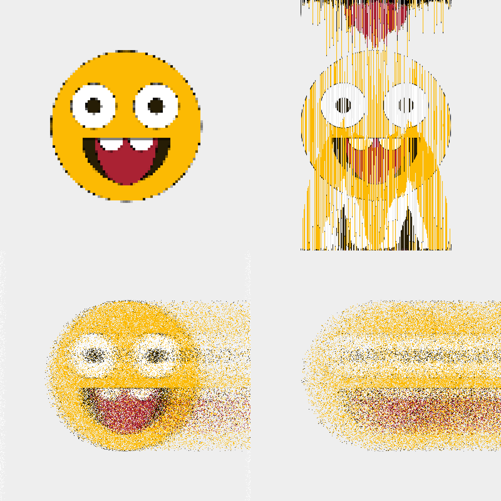

# p5-toolkit
A small set of effects and useful functions for [p5.js](https://p5js.org/ "p5.js"), a JavaScript library for creative coding


## Basic usage
```html
  <!-- Include in index.html before -->
  <script src="https://cdn.jsdelivr.net/gh/matthias-jaeger-net/p5-toolkit@6e50c96c118203d0b43bbb33b8b406712ae7db14/dist/p5-global-effects.min.js"></script>
```
```javascript
// Recommended:
// Import the effects globally inside of setup() and keep all there
function setup() {
  const effects = new Effects(this);
  ...
}

// Or use a global variable
let effects;
function setup() {
  effects = new Effects(this);
  ...
}
```
## Available Methods

### RANDOM NUMBER TOOLS
- ```randomOffset(val, off)``` A value with random positive or negative offset
- ```randomZeroOne()``` A random number between 0 and 1
- ```randomProb()``` True with a 50% percent probability
- ```givenProb(prob)``` True/false by given probability
- ```fuzzyValue(val)``` Either a slightly changed or dramtically reduced value

### COLOR TOOLS
- ```randomColor()``` Any possible color
- ```randomPastelColor()``` A brighter color
- ```randomDarkColor()``` A darker color
- ```shadedColor(col)``` A randomly changed color with low offset
- ```shadedColorOff(col, off)``` A randomly changed color and public offset

### COLOR PALETTES
- ```randomPalette(col, len)``` A color palette with a number of colors and a initial color
- ```relatedPalette(col, len)``` A color palette with colors based on the initial color

### TEXTURE GENERATORS
- ```stripes(res, colors)``` A randomly striped graphics buffer
-  ```dots(res, colors)```  A randomly dotted graphics buffer

 ### PIXEL EFFECTS
- ```randomBlurX(buffer) ``` A graphics buffer with dramatically changed colors
- ```fuzzyBlurX(buffer)``` A graphics buffer with dramatically changed colors
- ```mosaic(buffer)``` A graphics buffer with a tiled tesselation
- ```shiftedPixels(buffer)``` A graphics buffer with sifted rows of pixels

### LIGHT EFFECTS
- ```randomLight(buffer)```  Sets a white light in a random position in a buffer
- ```randomColoredLight(buffer, col)``` Sets a colored light in a random position in a buffer

### MASKING EFFECTS
- ```grainMask(buffer, prob)``` A buffer with a grainy alpha mask
- ```linesMask(buffer, prob)``` A buffer with a striped alpha mask

# Examples



## Example Basic
https://editor.p5js.org/matthias-jaeger-net/sketches/PQrZMbk45

## Example Intermediate
https://editor.p5js.org/matthias-jaeger-net/sketches/sN_Qu58Go

## Example Advanced
https://editor.p5js.org/matthias-jaeger-net/sketches/9FTcIkn-r

## Example Yetiadvanced
https://editor.p5js.org/matthias-jaeger-net/sketches/cFctVV7R2