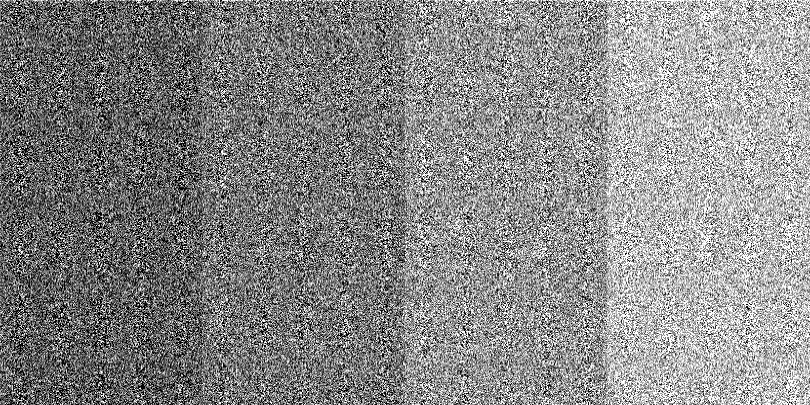

# p5-toolkit


# A collection of effects and other visual trickery in the context of [p5 sketches](https://p5js.org/).

I frequently use this single JavaScript file when I create artistic [generative images](https://www.instagram.com/_matthiasjaeger/). The collection currently contains methods for **colors**, **numbers**, **pixels**, **textures**, **hatches**, **masks** and **other useful tools**. See a short overview below or browse the [type docs](/docs) for a detailed information. These effects could be useful for **artists**, **designers** and fellow **creative coders**. Please be aware that this is a *personal* collection and it might change dramatically without warnings. The script adds a globally available class constructor called ``Effects`` to your disposal. The intended use is to locally create a *new instance* in ```setup()``` and use it's methods via the dot-syntax. Include the script in ```index.html``` and use it in ```sketch.js```.

```html
  <!-- index.html -->
  <script src="p5-global-effects.min.js" defer></script>
  <script src="sketch.js" defer></script>
```

# Pixel effects
Core pice of the file are the pixel effects. These are functions that take a ``p5.Graphics`` buffer or a ``p5.Image`` as  input and ``return`` a new buffer with a dramatically changed appearance. In the examples below the effect is applied on the left half of this [landscape photography](https://unsplash.com/photos/dM8INmkyDas).


```javascript
let img, effects;

function preload() {
  img = loadImage('Shannon-Kunkle.png');
}

function setup() {
  effects = new Effects(this);
  createCanvas(800, 400);
  image(effects.randomBlurX(img.get(0, 0, 400, 533), 9), 0, -140);
  image(img.get(400, 0, 800, 533), 400, -140);
}
```

### ```randomBlurX(buffer) ```


### ```fuzzyBlurX(buffer)```


### ```mosaic(buffer)```


### ```shiftedPixels(buffer)```


### ```glitchY(buffer)```


### ```puzzle(buffer)```


### ```gridScapes(buffer)```


### ```bufferStack(buffer)```


# Textures and Hatches

### ```hatchDots(buffer, density, color)```

```javascript
function setup() {
  createCanvas(800, 400);
  background(255);
  const effects = new Effects(this);
  for (let x = 0; x < width; x += 200) {
    const col = map(x, 0, width, 0, 200);
    const density = map(x, 0, width, 1, 0.1);
    image(effects.hatchDots(this, density, col), x, 0, 200, height);
  }
}
```
Utility functions to help generate and fill buffers, so later on effects can be applied. Currently under construction :D.

- [x] ```stripes(res, colors)``` A really randomly striped graphics buffer
- [x] ```dots(res, colors)```  A randomly dotted graphics buffer
- [x] ```hatchHorizontal(w, h, d, col)``` Regular hatching horizontally
- [x] ```hatchVertical(w, h, d, col)``` Regular hatching vertically
- [ ] ```hatchGrid(w, h, d)```
- [x] ```hatchDotGrid(w, h, d)```
- [ ] ```hatchRandomDots(w, h, d)```
- [ ] ```hatchRandomLines(w, h, d)```
- [ ] ```hatchMaze(w, h, d)```
- [ ] ```hatchSinusLines(w, h, d)```
- [ ] ```hatchFlowField(w, h, d)```


# Color tools
- [x] ```randomColor()``` Any possible color
- [x] ```randomBrightColor()``` A brighter color
- [x] ```randomDarkColor()``` A darker color
- [x] ```shadedColor(col)``` A randomly changed color with low offset
- [x] ```shadedColorOff(col, off)``` A randomly changed color and public offset
- [x] ```randomPalette(col, len)``` A color palette with a number of colors and a initial color
- [x] ```relatedPalette(col, len)``` A color palette with colors based on the initial color
- [ ] ```huePalette(col, len)``` A color palette with evenly spread hue based the initial color

## Masking effects
- [x] ```grainMask(buffer, prob)``` A buffer with a grainy alpha mask
- [x] ```linesMask(buffer, prob)``` A buffer with a striped alpha mask

## WEBGL light effects
- [x] ```randomLight(buffer)```  Sets a white light in a random position in a buffer
- [x] ```randomColoredLight(buffer, col)``` Sets a colored light in a random position in a buffer

## Typographic effects
- [ ] ```TODO```

## Blending effects
- [ ] ```TODO```

# Do you want to develop Effects?
```bash
# Clone the repository
git clone git@github.com:matthias-jaeger-net/p5-toolkit.git
```
```bash
# Navigate in the directory
cd p5-toolkit
```
```bash
# Install the development tools
npm install
```
NOTE: This will install the node modules I use for the development. You can check the [package.json](/package.json) for a full list. Briefly said it will install a very simple Webpack/Typescript/p5 setup for you. Having said that, because sometimes it can be strange with node modules...

**Available scripts**
```bash
# This generates the minified file in /dist/
npm run build
```
```bash
# This outputs the raw commonjs modules, not used currently
npm run compile
```
```bash
# Have no unit tests so far...
npm run test
```
```bash
# This generates api docs from typescript /src
npm run docs
```