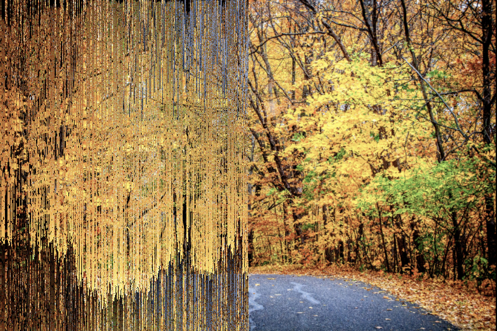
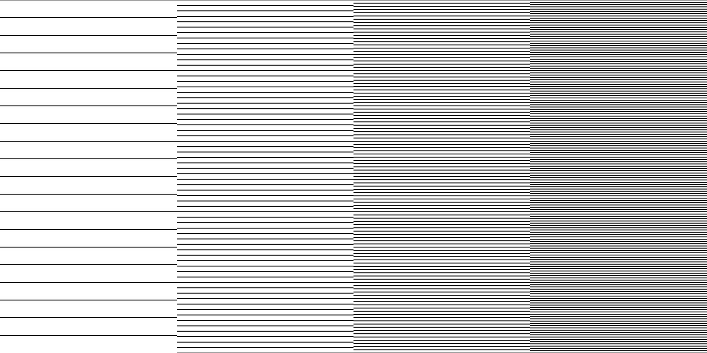
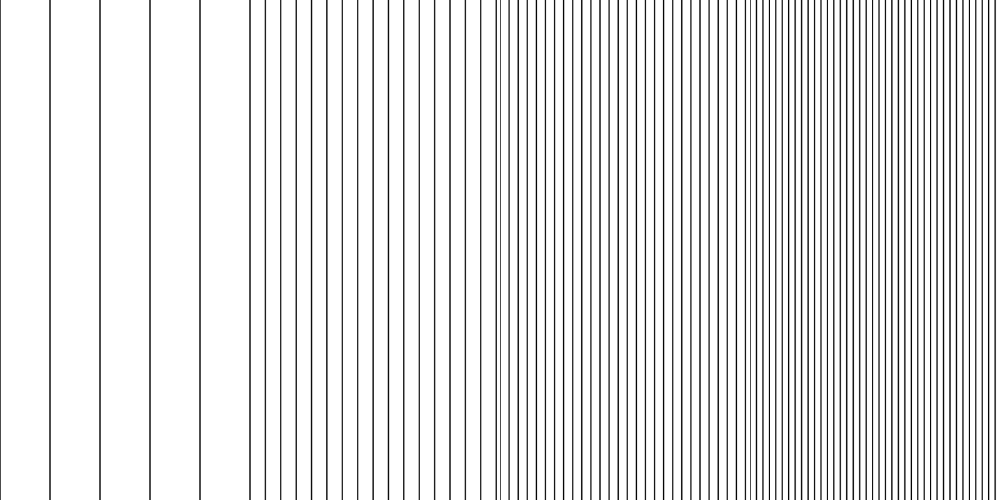

# p5-toolkit

## A collection of effects and other visual trickery in the context of [p5 sketches](https://p5js.org/).


I frequently use this single JavaScript file when I create artistic [generative images](https://www.instagram.com/_matthiasjaeger/). The collection currently contains methods for **colors**, **numbers**, **pixels**, **textures**, **hatches**, **masks** and **other useful tools**. See a short overview below or browse the [type docs](/docs) for a detailed information. These effects could be useful for **artists**, **designers** and fellow **creative coders**. Please be aware that this is a *personal* collection and it might change dramatically without warnings. The script adds a globally available class constructor called ``Effects`` to your disposal. The intended use is to locally create a *new instance* in ```setup()``` and use it's methods via the dot-syntax. Include the script in ```index.html``` and use it in ```sketch.js```. The class currently has four groups of public available Methods. numbers, colors, pixel, texture.


# Pixel
These are functions that take a ``p5.Graphics`` buffer or a ``p5.Image`` as  input and ``return`` a new buffer with a dramatically changed appearance. In the examples below the effect is applied on the left half of this [landscape photography](https://unsplash.com/photos/dM8INmkyDas).

```html
<!-- index.html -->
<script src="p5-global-effects.min.js" defer></script>
<script src="sketch.js" defer></script>
```
```javascript
let img, effects;

function preload() {
  img = loadImage('Shannon-Kunkle.png');
}

function setup() {
  createCanvas(img.width, img.height);
  effects = new Effects(this);

  // Splits the image in two halfs
  const half = img.width / 2;
  const left = img.get(0, 0, half, img.height);
  const right = img.get(half, 0, img.width, img.height);

  // Apply the sspread effect on the left half
  image(effects.pixel.spread(left), 0, 0);
  image(right, half, 0);
}

```

### ```pixel.spread(buffer)```


### ```pixel.fuzzy(buffer)```


### ```pixel.mosaic(buffer)```


### ```shift(buffer)```


### ```pixel.glitch(buffer)```


### ```pixel.puzzle(buffer)```


### ```pixel.linify(buffer)```


### ```pixel.shrink(buffer)```


# Texture

Texture functions help me to generate buffers quickly, so later on effects can be applied.  Unlike the pixel effects textures have **more parameters**. The ``density`` should be a positive number between zero and one and scales the effects in one way or the other. The ``color`` parameter and is a ``p5.Color`` to be used for the generated geometry. In the examples below I used ``color(0)`` which means black, for simplicity, but I vary the density from left tor right. Every texture function will ``return`` a transparent graphics buffer the generated texture.


### ```dots(options)```

```javascript
const bars = effects.hatch.bars(width, height, color(0));
```

### ```stripes(density, color)```


### ```bars(density, color)```


### ```grain(density, color)```


### ```corroded(density, color)```


# Numbers
### ```numbers.prob()```
### ```numbers.givenProb(val)```
### ```numbers.fuzzyValue: (val)```
### ```numbers.offset(val, off)```

# Colors

I have to say the following: Don't use random colors in your sketches, :D. Carfully picked ones are much better than any generated color. Having said that, lets go on.

#### ```any()```
```javascript
// Returns any random p5.Color
const col = effects.any();
```
#### ```bright()```
```javascript
// Returns a bright random p5.Color
// equals: const col = color(random(100, 255), random(100, 255), random(100, 255))
const col = effects.bright();
```

#### ```dark()```
```javascript
// Returns a dark random p5.Color
// equals: const col = color(random(0, 90), random(0, 90), random(0, 90))
const col = effects.color.any();
```
#### ```set(len)```
#### ```palette(len)```
#### ```relatives(col, len)```

# Legacy
- [x] ```striped(res, colors)``` A really randomly striped graphics buffer
- [ ] ```hatchMaze(w, h, d)```
- [ ] ```hatchSinusLines(w, h, d)```
- [ ] ```hatchFlowField(w, h, d)```


# Do you want to develop Effects yourself?
```bash
# Clone the repository
git clone git@github.com:matthias-jaeger-net/p5-toolkit.git
```
```bash
# Navigate in the directory
cd p5-toolkit
```
```bash
# Install the development tools
npm install
```
NOTE: This will install the node modules I use for the development. You can check the [package.json](/package.json) for a full list. Briefly said it will install a very simple Webpack/Typescript/p5 setup for you. Having said that, because sometimes it can be strange with node modules...

**Available scripts**
```bash
# This generates the minified file in /dist/
npm run build
```
```bash
# This outputs the raw commonjs modules, not used currently
npm run compile
```
```bash
# Have no unit tests so far...
npm run test
```
```bash
# This generates api docs from typescript /src
npm run docs
```